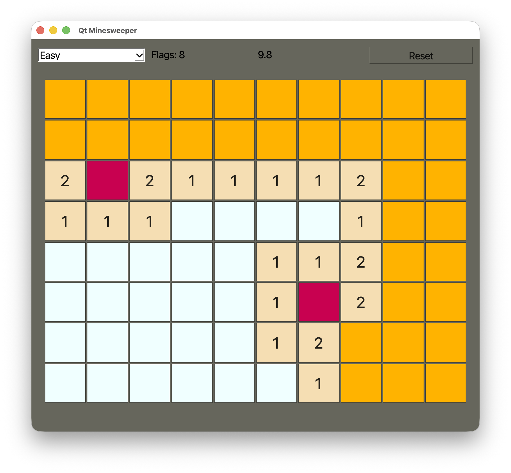

# Qt Minesweeper

과거 객체지향 프로그래밍 과제로 손코딩했던 C++/Qt 기반 지뢰찾기 프로그램을 현재 환경에서 다시 빌드하고 실행할 수 있도록 정리한 프로젝트입니다.

원 과제 보고서는 `문서2.pdf`로 함께 보관되어 있으며, 현재 README는 원본 과제 자료와 현재 빌드/배포 환경을 구분해 정리합니다.

코드는 `MainWindow`, `Pan`, `MyButton`, `timego` 클래스를 중심으로 구성됩니다. Qt 기본 위젯을 상속해 게임 창, 지뢰판, 개별 칸 버튼, 플레이 시간 표시를 나누어 구현했습니다.

## 스크린샷



## 개발 환경

- Language: C++17
- Framework: Qt Widgets
- Primary build: qmake (`real-assn5.pro`)
- Optional build: CMake (`CMakeLists.txt`)
- Tested on: macOS with Qt 6 installed by Homebrew
- Expected to build on: Windows with Qt 5/6 MinGW or MSVC Kit

## 주요 기능

- Easy, Medium, Hard 난이도 선택
- 무작위 지뢰 배치
- 첫 클릭 지뢰 방지
- 좌클릭으로 칸 열기
- 우클릭으로 깃발 표시 및 해제
- 빈 칸 주변 자동 열기
- 지뢰 클릭 시 패배 처리
- 모든 안전 칸을 열면 승리 처리
- Reset 버튼으로 새 게임 시작
- 플레이 시간 표시

## 빌드 및 실행

Qt Widgets가 포함된 Qt 5 또는 Qt 6 환경이 필요합니다. 이 프로젝트는 qmake와 CMake 설정을 모두 제공합니다.

### Qt Creator 사용

1. Qt Creator에서 `real-assn5.pro` 파일을 엽니다.
2. Qt Widgets를 포함한 Qt Kit을 선택합니다.
3. Build 후 Run을 실행합니다.

### qmake 사용

```bash
qmake real-assn5.pro
make
./qt-minesweeper
```

Windows에서 MinGW Kit을 사용하는 경우:

```bash
qmake real-assn5.pro
mingw32-make
release\qt-minesweeper.exe
```

### CMake 사용

```bash
cmake -S . -B build
cmake --build build
./build/qt-minesweeper
```

Windows에서는 빌드 산출물 위치가 사용하는 generator와 configuration에 따라 `build/Debug` 또는 `build/Release` 아래에 생성될 수 있습니다.

## 플랫폼별 메모

### macOS

macOS에서는 Homebrew Qt 6.11.0 환경에서 CMake 빌드 및 실행을 확인했습니다.

```bash
cmake -S . -B build -DCMAKE_EXPORT_COMPILE_COMMANDS=ON
cmake --build build
open build/qt-minesweeper.app
```

배포용 앱을 만들 때는 Qt 프레임워크를 `.app` 안에 포함해야 다른 Mac에서도 실행될 가능성이 높아집니다.

```bash
macdeployqt build/qt-minesweeper.app
ditto -c -k --sequesterRsrc --keepParent build/qt-minesweeper.app dist/qt-minesweeper-macos.zip
```

### Windows

Windows에서는 직접 실행 테스트를 하지는 않았지만, 코드가 Qt Widgets 표준 API와 C++17만 사용하므로 Qt 5/6 Kit에서 빌드될 가능성이 높습니다. 경로 구분자나 macOS 전용 API를 코드에서 직접 사용하지 않습니다.

Qt Creator를 사용하는 경우 `real-assn5.pro` 또는 `CMakeLists.txt`를 열고 MinGW 또는 MSVC Kit을 선택해 빌드하면 됩니다.

MinGW qmake 예시:

```bat
qmake real-assn5.pro
mingw32-make
release\qt-minesweeper.exe
```

CMake 예시:

```bat
cmake -S . -B build
cmake --build build --config Release
build\Release\qt-minesweeper.exe
```

Windows에서 실행 파일을 다른 PC에 배포하려면 Qt DLL을 함께 복사해야 합니다. Qt가 제공하는 `windeployqt`를 사용하는 것이 가장 일반적입니다.

```bat
windeployqt build\Release\qt-minesweeper.exe
```

Windows에서 확인해야 할 수 있는 점:

- 사용하는 Qt Kit에 따라 실행 파일 위치가 `build\Release`, `build\Debug`, `release`, `debug` 중 하나일 수 있습니다.
- MSVC Kit으로 빌드한 실행 파일은 해당 Visual C++ Runtime이 필요할 수 있습니다.
- Windows에서는 `.app` 파일을 사용할 수 없고 `.exe`를 따로 빌드해야 합니다.

## 프로젝트 구조

```text
.
├── CMakeLists.txt       # CMake 빌드 설정
├── README.md            # 프로젝트 설명
├── real-assn5.pro       # qmake 빌드 설정
├── 문서2.pdf             # 원 과제 보고서 자료
├── main.cpp             # QApplication 및 MainWindow 실행 진입점
├── mainwindow.ui        # Qt Designer UI 기본 창
├── mainwindow.h/.cpp    # 난이도, 타이머, 리셋 버튼, 게임판 관리
├── pan.h/.cpp           # 지뢰찾기 게임판, 지뢰 배치, 승패 판정
├── mybutton.h/.cpp      # 각 칸 버튼, 좌/우클릭, 깃발, 열기 동작
└── timego.h/.cpp        # 플레이 시간 표시
```

## 메모

원래 과제 코드의 클래스 구조와 변수명은 최대한 유지했습니다. 원 과제 보고서 자료는 기존 텍스트 파일 대신 `문서2.pdf`로 보관합니다. 현재 정리는 실행 가능성, GitHub 업로드, Qt 버전 및 플랫폼 차이로 생길 수 있는 빌드 문제를 줄이는 데 초점을 두었습니다.
